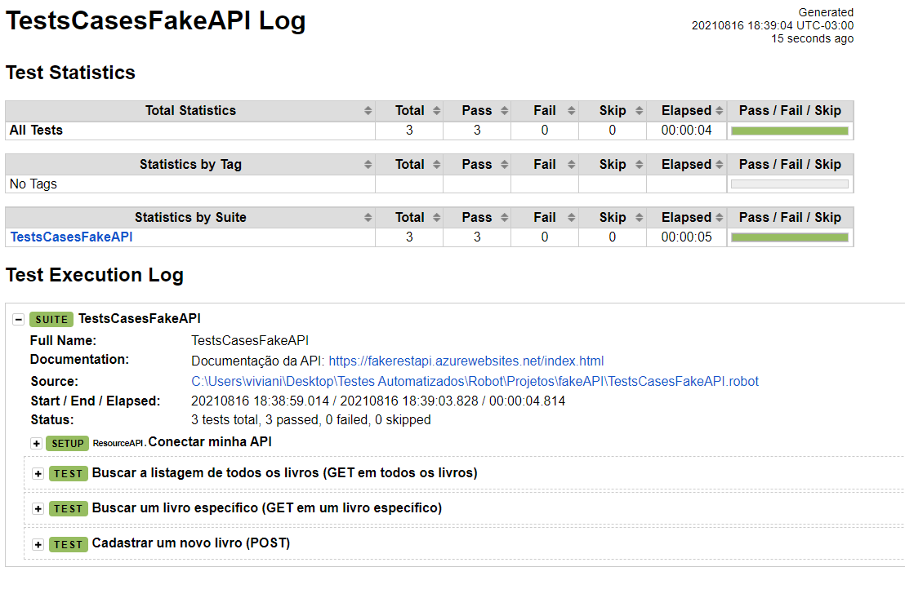

# Testes de API com Robot Framework

No Robot existe duas librarys bem importantes que conseguimos desenvolver testes de API em nosso projeto.São elas:

**Library RequestsKeywords:** Usa uma library request do Python por baixo.

* Keywords:  [https://marketsquare.github.io/robotframework-requests/doc/RequestsLibrary.html](https://marketsquare.github.io/robotframework-requests/doc/RequestsLibrary.html)
  * Importante: CreateSession: para o Robot se conectar a API. Campos obrigatórios: url e alias.

**Library Collections:** para manipular o retorno da API em Json e os asserts. Trabalha com listas\(arrays\) e dicionários\(Json\).

* Keywords: [http://robotframework.org/robotframework/latest/libraries/Collections.html](http://robotframework.org/robotframework/latest/libraries/Collections.html)

**Importante:** 

O comando para rodar os testes no Visual Studio Code pelo cmd é: **robot -d .\results TestsCasesFakeAPI.robot,** sendo que results é a pasta que iremos guardar os arquivos .html de log e report e **TestsCasesFakeAPI.robot** é o nome da suite de teste aqui exemplificada.

## Automatizando uma requisição GET 

Aqui a requisição Get é feita através do método **GET on Session** da Library RequestsLibrary.

Nela estamos passando a URL fakeAPI e a URI v1/Books e guardando a resposta na variável global RESPOSTA.

O Log exibe o trecho em formato texto através do sufixo .text.

* Mais formatos podem ser consultados neste [doc.](http://rch-sl04:9000/mod06-response.pdf)

## Conferências da requisição 

Ex: Conferir o status code, reason e lista.

* [O que é HTTP, HTTP error e os principais códigos que você precisa saber](http://rch-sl04:9000/mod06_http_status.pdf)

## Conferências do JSON Body 

Importante ficar atento aos espaços, tabs.

Aqui estamos usando a variável &{BOOK\_15} que contem a resposta do dicionário.

Para a verificação dos campos podemos utilizar **Dictionary Should Contain Item** e também **Should Not Be Empty,** por exemplo.

* [Dicas de conferências em JSON](http://rch-sl04:9000/mod06_conferenciasjson.pdf)

## Automatizando uma requisição POST com HEADER e BODY 

No Robot podemos enviar o POST através do método **Post On Session** da Library RequestsLibrary.

No exemplo abaixo estamos enviando o data, que é corpo da requisição e também o header.  

## Results 

Relátorio de Logs.

Dentro de cada Tag como Setup, Test, temos as Keywords executadas com seus retornos.

 fonte: Curso Automação de Testes com Robot Framework - Udemy. **por** [**Mayara Fernandes**](https://www.udemy.com/user/mayara-ribeiro-fernandes/)

