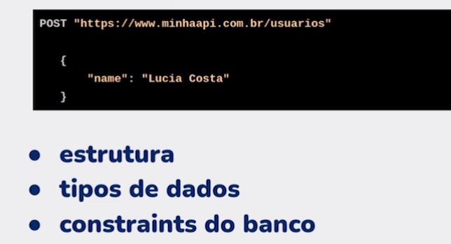
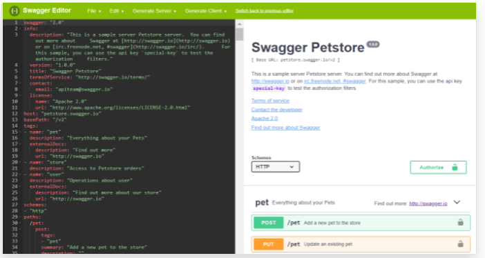
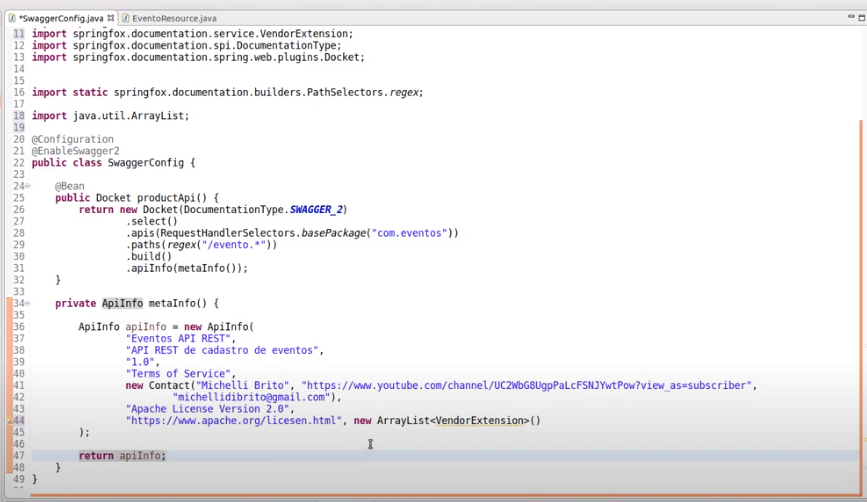
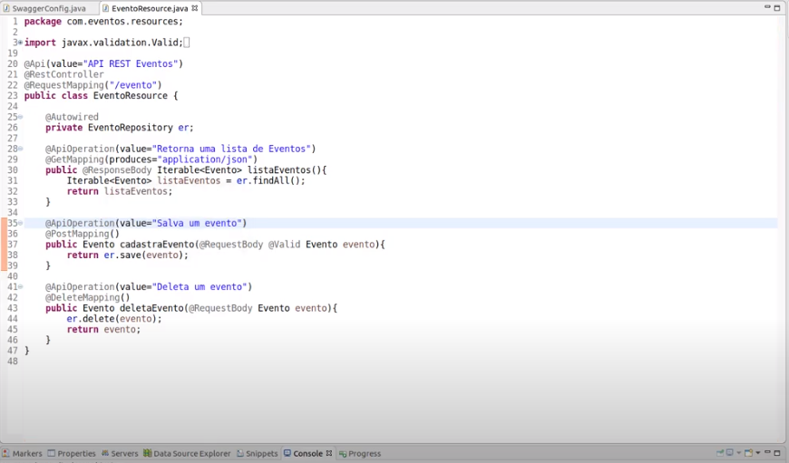
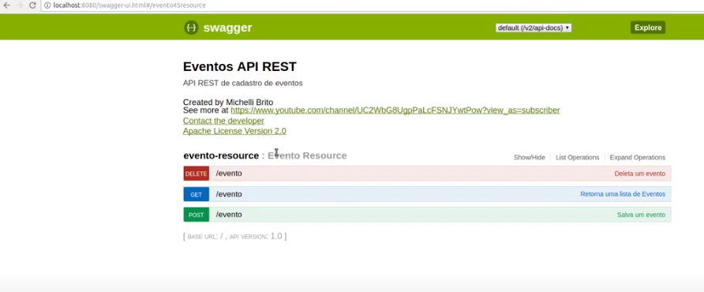

# Testes de Contrato e Documentação

## **API: Testes de contrato** <a id="api-testes-de-contrato"></a>

**Contrato:** Um acordo entre duas \(ou mais\) partes . No contexto de teste está associado em qualquer interação entre serviços. Ex: microserviços, API Rest, etc. Ele tenta evitar qualquer tipo de ruído entre Consumer e Provider.


Ná prática é quando a gente faz um GET em um end-point REST e recebe um array ou outro tipo dado. Podemos fazer também POST, PUT, DELETE. 

O teste de Contrato tem que validar:

* estrutura dos dados
* tipo de dados
* constraints do banco
* status Code



As formas que temos de interagir com um provider ou consumer precisam estar documentadas. 

### Ferramentas que podemos criar: 

* **Swagger:** é uma linguagem de descrição de interface para descrever APIs RESTful expressas usando JSON. O Swagger é usado junto com um conjunto de ferramentas de software de código aberto para projetar, construir, documentar e usar serviços da Web RESTful.
* **Pact:** lib para testes com detecção dos contratos e mock das interações.Pode ser usado com várias linguagens.
* **Joi:** lib de testes para validação de schemas e objetos. Para JavaScript.
* **Postman Newman:** teste de coleções integrado ao CI/CD.

### **Validação de contratos** <a id="valida&#xE7;&#xE3;o-de-contratos"></a>

**Requisição o que validar:**

* **métodos:** É um método aceito? \(Get, PUT, POST, DELETE\)
* **header, body e query params:** O que acontece se faltarem informações?

**Resposta o que validar:**

* **header:** As infos são esperadas? \(Content-type, …\)
* **body:** A estrutura é a esperada?\(Keys, Json,…\)
* **status code:** Os status code de erro são os esperados?

## Documentação da API: Padrão OpenAPI <a id="documenta&#xE7;&#xE3;o-da-api-padr&#xE3;o-openapi"></a>

A **especificação OpenAPI** , anteriormente conhecida como **especificação Swagger** , é uma especificação para arquivos de interface legíveis por máquina para descrever, produzir, consumir e visualizar serviços da web RESTful . Anteriormente parte da estrutura Swagger , tornou-se um projeto separado em 2016, supervisionado pela OpenAPI Initiative, um projeto de colaboração de código aberto da Linux Foundation . Swagger e algumas outras ferramentas podem gerar código, documentação e casos de teste a partir de um arquivo de interface.

Existe bibliotecas que ajudam a implementar o padrão OpenAPI na API Rest. 

### **Usando o Postman:** <a id="usando-o-postman"></a>

* New → API Documentation → Select an existing collection → Save
* Na aba seguinte será disponibilizado um link para acesso da Documentação criada. Obs: Pode que aconteça problema de CORS, neste caso , podemos acessar a documentação dentro do Postman, Collections → Na Coleção clicar na setinha a esquerda → Documentation.

fonte: Curso Alura. **por** [**Juliana Amoasei**](https://cursos.alura.com.br/user/juliana-amoasei)

### **Usando o Swagger:** <a id="usando-o-swagger"></a>

**Swagger Editor:**

O Swagger disponibiliza um Editor que podemos escrever a documentação da API não importando a linguagem. Pode ser usado o padrão yaml ou Json.



**No Java:**

Colocar as dependencias Swagger do Maven no arquivo pom.xml do seu projeto:

#### Springfox Swagger UI <a id="springfox-swagger-ui"></a>

```text
<!-- https://mvnrepository.com/artifact/io.springfox/springfox-swagger-ui -->
<dependency>
    <groupId>io.springfox</groupId>
    <artifactId>springfox-swagger-ui</artifactId>
    <version>3.0.0</version>
</dependency>
```

#### Springfox Swagger2 » 3.0.0 <a id="springfox-swagger2-300"></a>

```text
<!-- https://mvnrepository.com/artifact/io.springfox/springfox-swagger2 -->
<dependency>
    <groupId>io.springfox</groupId>
    <artifactId>springfox-swagger2</artifactId>
    <version>3.0.0</version>
</dependency>
```

Criar a classe no seu projeto Java conforme imagem abaixo:



Depois, devemos colocar as anotações Api e ApiOperation em cada chamada das Requisições.



Feito isso, é só rodar a aplicação e acessar através de host da aplicação/swagger-ui.html.



