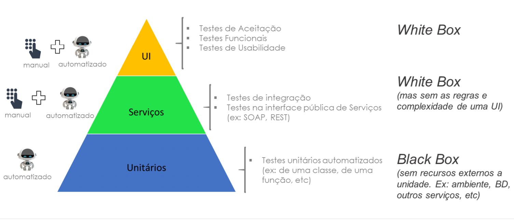

# Testes de Software

## Tipos de Testes de Software 

**1. Teste de Aceitação:** verificam se o produto realmente resolve o problema que foi feito para resolver. Isso pode ser feito melhor pelo usuário \(cliente\), por exemplo, executando suas tarefas com as quais o software auxilia.

**2. Teste de Funcional:** o teste funcional consiste em uma série de subtestes \(técnicas\), cujo objetivo é atestar se a aplicação é capaz de desempenhar as funções que se propõe a fazer. As técnicas mais comuns englobadas pelo teste funcional são os testes denominados caixa-branca e caixa-preta.

* **Teste de Caixa Branca:** tem como foco a análise do comportamento interno do software, ou seja, o seu código-fonte.
* **Caixa Preta:** é feito em cima das funções que devem ser desempenhadas pelo programa.

**3. Teste de Usabilidade:** Teste focado na experiência do usuário, consistência da interface, layout, acesso às funcionalidades etc.

* [Testes de UI com Robot Framework](https://app.gitbook.com/@programacao/s/qualidade/~/drafts/-MkgN7PGQoFNvS5TRgjV/testes-de-integracao/testes-de-api-com-robot-framework)
* Testes de UI com Java

**4. Teste de Integração:** Testa se um ou mais componentes combinados funcionam de maneira satisfatória. Há quem diga que o teste de integração é composto por vários testes de unidade.

* [Testes de Contrato e Documentação](https://app.gitbook.com/@programacao/s/qualidade/~/drafts/-MkgN7PGQoFNvS5TRgjV/testes-de-integracao/testes-de-contrato-e-documentacao)
* [Testes de API com Postman](https://app.gitbook.com/@programacao/s/qualidade/~/drafts/-MkgN7PGQoFNvS5TRgjV/testes-de-integracao/testes-de-api-com-postman)
* [Testes de API com Robot Framework](https://app.gitbook.com/@programacao/s/qualidade/~/drafts/-MkgN7PGQoFNvS5TRgjV/testes-de-integracao/testes-de-api-com-robot-framework)

**5. Teste de Performance:** O teste de performance se divide em 3 tipos:

1. **Teste de carga:** Testa o software sob as condições normais de uso. Ex.: tempo de resposta, número de transações por minuto, usuários simultâneos etc.
2. **Teste de stress:** Testa o software sob condições extremas de uso. Grande volume de transações e usuários simultâneos. Picos excessivos de carga em curtos períodos de tempo.
3. **Teste de estabilidade:** Testa se o sistema se mantém funcionando de maneira satisfatória após um período de uso.

**6. Teste de Regressão:** Reteste de um sistema ou componente para verificar se alguma modificação recente causou algum efeito indesejado, além de, certificar se o sistema ainda atende os requisitos.

**7. Teste de Segurança:** Testa se o sistema e os dados são acessados de maneira segura, apenas pelo autor das ações.

**8. Teste de Unidade:** Testa um componente isolado ou classe do sistema.

**9. Teste de Configuração:**  Testa se o software funciona no hardware a ser instalado.

**10. Teste de Instalação :**  Testa se o software instala como planejado, em diferentes hardwares e sob diferentes condições, como pouco espaço de memória, interrupções de rede, interrupções na instalação etc.

**11. Teste de integridade:** Testa a resistência do software à falhas \(robustez\).

**12. Teste de Volume:** Testa o comportamento do sistema operando com o volume “normal” de dados e transações envolvendo o banco de dados durante um longo período de tempo.

**13. Teste de Manutenção:** Testa se a mudança de ambiente não interferiu no funcionamento do sistema.

